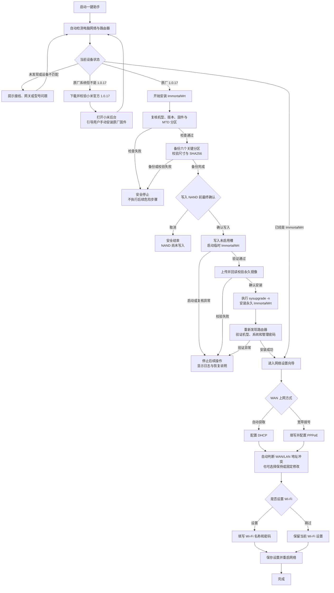

# AX3600 ImmortalWrt 一键助手

Windows 离线桌面程序。打开后自动识别当前路由器状态，并只显示当前可执行的主操作。

## 当前能力

- 自动发现默认网关和 AX3600 原厂系统。
- 自动区分原厂可安装、需要准备 1.0.17、ImmortalWrt、其他 OpenWrt 和设备不匹配。
- 下载并固定 SHA256 校验小米官方 1.0.17，同时生成 `C0A81F02.img`。
- 完整两阶段安装引擎：一次性 SSH、机型/版本/MTD 复核、六分区备份、双端哈希、未启动槽写入、临时系统验证、全新永久安装和最终登录复检。
- 文件传输全部由程序内部完成，不依赖 Windows OpenSSH、SCP 或路由器 SFTP。
- 重启阶段自动更新 Windows DHCP，并探测 ImmortalWrt 默认地址 `192.168.1.1`。
- 写入前生成 `backup-manifest.json`、`recovery-plan.json` 和中文恢复说明；写入后的异常不会再误报为“路由器未修改”。
- 刷机完成后的 WAN、LAN 和 Wi-Fi 设置向导，以及备份查看和连接检查入口。
- 本地日志、备份和恢复目录。
- 所有固件写入受 `resources/firmware-manifest.json` 发布锁控制。

## 使用流程



流程中的检查、备份和校验任一步失败都会停止后续操作。首次写入 NAND 前还会进行一次明确确认；写入后如果发生异常，软件会说明设备已经执行到哪一步，并保留日志和恢复资料。

## 安全状态

内置固件来自 ImmortalWrt 官方下载站，版本为 25.12.2，并固定 SHA256。代码和离线检查不能代替一次完整的实体 AX3600 安装验证；项目会保留 `hardwareValidated: false`，直到完整真机流程成功。

## V1.0.0 验证范围

- 原厂 1.0.17 一次性登录、分区身份与尺寸校验。
- 本地备份尺寸与 SHA256 校验，原启动槽和恢复状态持久化。
- 临时镜像与永久镜像均使用内部 SSH 数据流传输；上传后从路由器逐字节回读，在电脑端复算尺寸和 SHA256，不依赖路由器自带校验命令。
- 临时系统和永久系统分别重新发现地址、验证 AX3600 身份。
- 永久安装执行官方要求的 `sysupgrade -n`，完成后设置并实际复验新管理密码。

## 开发运行

```text
npm install
npm run dev
```

## 打包

```text
npm run dist
```

生成文件位于 `dist/AX3600-ImmortalWrt-Assistant-<version>-portable.exe`。
